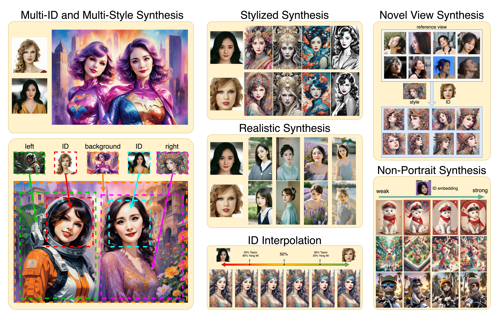

# InstantID
 
 

**InstantID : Zero-shot Identity-Preserving Generation in Seconds**

## Abstract

Existing personalization generation methods, such as Textual Inversion, DreamBooth, and LoRA, have made significant progress in custom image creation. However, these works require expensive computational resources and time for fine-tuning, and require multiple reference images, which limits their application in the real world. InstantID addresses these limitations by leveraging a plug-and-play module, enabling it to adeptly handle image personalization in any style using only one face image while maintaining high fidelity. To preserve the face identity, we introduce a novel face encoder to retain the intricate details of the reference image. InstantID's performance and efficiency in diverse scenarios show its potentiality in various real-world applications. Our work is compatible with common pretrained text-to-image diffusion models such as SD1.5 and SDXL as a plugin. Code and pre-trained checkpoints will be made public soon!

## Demos

Coming soon.

## Code

Coming soon.

## Cite

To be updated.
