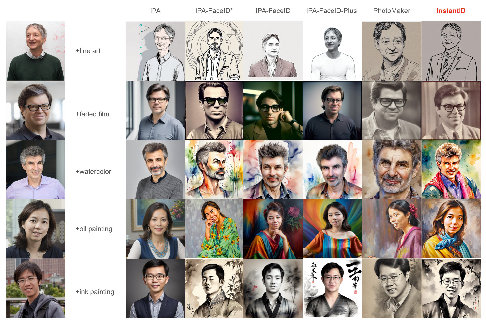
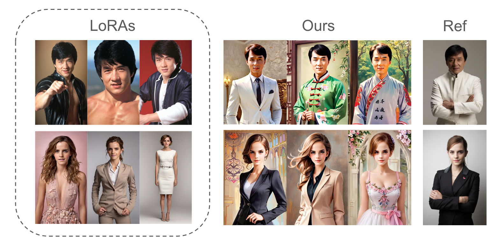
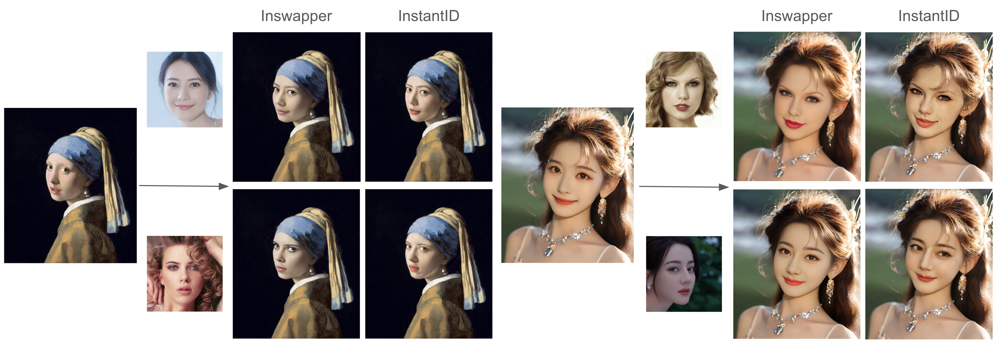

<div align="center">
<h1>InstantID: Zero-shot Identity-Preserving Generation in Seconds</h1>

[**Qixun Wang**](https://github.com/wangqixun)<sup>12</sup> · [**Xu Bai**](https://huggingface.co/baymin0220)<sup>12</sup> · [**Haofan Wang**](https://haofanwang.github.io/)<sup>12*</sup> · [**Zekui Qin**](https://github.com/ZekuiQin)<sup>12</sup> · [**Anthony Chen**](https://antonioo-c.github.io/)<sup>123</sup>

Huaxia Li<sup>2</sup> · Xu Tang<sup>2</sup> · Yao Hu<sup>2</sup>

<sup>1</sup>InstantX Team · <sup>2</sup>Xiaohongshu Inc · <sup>3</sup>Peking University

<sup>*</sup>corresponding authors

<a href='https://instantid.github.io/'></a>
<a href='https://arxiv.org/abs/2401.07519'></a>
<a href='https://huggingface.co/papers/2401.07519'></a> 
[](https://github.com/InstantID/InstantID)

<a href='https://huggingface.co/spaces/InstantX/InstantID'></a>
[](https://modelscope.cn/studios/instantx/InstantID/summary)
[](https://openxlab.org.cn/apps/detail/InstantX/InstantID)

</div>

InstantID is a new state-of-the-art tuning-free method to achieve ID-Preserving generation with only single image, supporting various downstream tasks.


## Release
- [2024/07/18] 🔥 We are training InstantID for [Kolors](https://huggingface.co/Kwai-Kolors/Kolors-diffusers). The weight requires significant computational power, which is currently in the process of iteration. After the model training is completed, it will be open-sourced. The latest checkpoint results are referenced in [Kolors Version](#kolors-version). 
- [2024/04/03] 🔥 We release our recent work [InstantStyle](https://github.com/InstantStyle/InstantStyle) for style transfer, compatible with InstantID!
- [2024/02/01] 🔥 We have supported LCM acceleration and Multi-ControlNets on our [Huggingface Spaces Demo](https://huggingface.co/spaces/InstantX/InstantID)! Our depth estimator is supported by [Depth-Anything](https://github.com/LiheYoung/Depth-Anything).
- [2024/01/31] 🔥 [OneDiff](https://github.com/siliconflow/onediff?tab=readme-ov-file#easy-to-use) now supports accelerated inference for InstantID, check [this](https://github.com/siliconflow/onediff/blob/main/benchmarks/instant_id.py) for details!
- [2024/01/23] 🔥 Our pipeline has been merged into [diffusers](https://github.com/huggingface/diffusers/blob/main/examples/community/pipeline_stable_diffusion_xl_instantid.py)!
- [2024/01/22] 🔥 We release the [pre-trained checkpoints](https://huggingface.co/InstantX/InstantID), [inference code](https://github.com/InstantID/InstantID/blob/main/infer.py) and [gradio demo](https://huggingface.co/spaces/InstantX/InstantID)!
- [2024/01/15] 🔥 We release the [technical report](https://arxiv.org/abs/2401.07519).
- [2023/12/11] 🔥 We launch the [project page](https://instantid.github.io/).

## Demos

### Stylized Synthesis

<p align="center">
  
</p>

### Comparison with Previous Works

<p align="center">
  
</p>

Comparison with existing tuning-free state-of-the-art techniques. InstantID achieves better fidelity and retain good text editability (faces and styles blend better).

<p align="center">
  
</p>

Comparison with pre-trained character LoRAs. We don't need multiple images and still can achieve competitive results as LoRAs without any training.

<p align="center">
  
</p>

Comparison with InsightFace Swapper (also known as ROOP or Refactor). However, in non-realistic style, our work is more flexible on the integration of face and background.

### Kolors Version

We have adapted InstantID for [Kolors](https://huggingface.co/Kwai-Kolors/Kolors-diffusers). Leveraging Kolors' robust text generation capabilities 👍👍👍, InstantID can be integrated with Kolors to simultaneously generate **ID** and **text**.


| demo | demo | demo |
|:-----:|:-----:|:-----:|
|||


## Download

You can directly download the model from [Huggingface](https://huggingface.co/InstantX/InstantID).
You also can download the model in python script:

```python
from huggingface_hub import hf_hub_download
hf_hub_download(repo_id="InstantX/InstantID", filename="ControlNetModel/config.json", local_dir="./checkpoints")
hf_hub_download(repo_id="InstantX/InstantID", filename="ControlNetModel/diffusion_pytorch_model.safetensors", local_dir="./checkpoints")
hf_hub_download(repo_id="InstantX/InstantID", filename="ip-adapter.bin", local_dir="./checkpoints")
```

Or run the following command to download all models:

```python
pip install -r gradio_demo/requirements.txt
python gradio_demo/download_models.py
```

If you cannot access to Huggingface, you can use [hf-mirror](https://hf-mirror.com/) to download models.
```python
export HF_ENDPOINT=https://hf-mirror.com
huggingface-cli download --resume-download InstantX/InstantID --local-dir checkpoints --local-dir-use-symlinks False
```

For face encoder, you need to manually download via this [URL](https://github.com/deepinsight/insightface/issues/1896#issuecomment-1023867304) to `models/antelopev2` as the default link is invalid. Once you have prepared all models, the folder tree should be like:

```
  .
  ├── models
  ├── checkpoints
  ├── ip_adapter
  ├── pipeline_stable_diffusion_xl_instantid.py
  └── README.md
```

## Usage

If you want to reproduce results in the paper, please refer to the code in [infer_full.py](infer_full.py). If you want to compare the results with other methods, even without using depth-controlnet, it is recommended that you use this code. 

If you are pursuing better results, it is recommended to follow [InstantID-Rome](https://github.com/instantX-research/InstantID-Rome).

The following code👇 comes from [infer.py](infer.py). If you want to quickly experience InstantID, please refer to the code in [infer.py](infer.py). 


```python
# !pip install opencv-python transformers accelerate insightface
import diffusers
from diffusers.utils import load_image
from diffusers.models import ControlNetModel

import cv2
import torch
import numpy as np
from PIL import Image

from insightface.app import FaceAnalysis
from pipeline_stable_diffusion_xl_instantid import StableDiffusionXLInstantIDPipeline, draw_kps

# prepare 'antelopev2' under ./models
app = FaceAnalysis(name='antelopev2', root='./', providers=['CUDAExecutionProvider', 'CPUExecutionProvider'])
app.prepare(ctx_id=0, det_size=(640, 640))

# prepare models under ./checkpoints
face_adapter = f'./checkpoints/ip-adapter.bin'
controlnet_path = f'./checkpoints/ControlNetModel'

# load IdentityNet
controlnet = ControlNetModel.from_pretrained(controlnet_path, torch_dtype=torch.float16)

base_model = 'wangqixun/YamerMIX_v8'  # from https://civitai.com/models/84040?modelVersionId=196039
pipe = StableDiffusionXLInstantIDPipeline.from_pretrained(
    base_model,
    controlnet=controlnet,
    torch_dtype=torch.float16
)
pipe.cuda()

# load adapter
pipe.load_ip_adapter_instantid(face_adapter)
```

Then, you can customized your own face images

```python
# load an image
face_image = load_image("./examples/yann-lecun_resize.jpg")

# prepare face emb
face_info = app.get(cv2.cvtColor(np.array(face_image), cv2.COLOR_RGB2BGR))
face_info = sorted(face_info, key=lambda x:(x['bbox'][2]-x['bbox'][0])*(x['bbox'][3]-x['bbox'][1]))[-1]  # only use the maximum face
face_emb = face_info['embedding']
face_kps = draw_kps(face_image, face_info['kps'])

# prompt
prompt = "film noir style, ink sketch|vector, male man, highly detailed, sharp focus, ultra sharpness, monochrome, high contrast, dramatic shadows, 1940s style, mysterious, cinematic"
negative_prompt = "ugly, deformed, noisy, blurry, low contrast, realism, photorealistic, vibrant, colorful"

# generate image
image = pipe(
    prompt,
    negative_prompt=negative_prompt,
    image_embeds=face_emb,
    image=face_kps,
    controlnet_conditioning_scale=0.8,
    ip_adapter_scale=0.8,
).images[0]
```

To save VRAM, you can enable CPU offloading
```python
pipe.enable_model_cpu_offload()
pipe.enable_vae_tiling()
```

## Speed Up with LCM-LoRA

Our work is compatible with [LCM-LoRA](https://github.com/luosiallen/latent-consistency-model). First, download the model.

```python
from huggingface_hub import hf_hub_download
hf_hub_download(repo_id="latent-consistency/lcm-lora-sdxl", filename="pytorch_lora_weights.safetensors", local_dir="./checkpoints")
```

To use it, you just need to load it and infer with a small num_inference_steps. Note that it is recommendated to set guidance_scale between [0, 1].
```python
from diffusers import LCMScheduler

lcm_lora_path = "./checkpoints/pytorch_lora_weights.safetensors"

pipe.load_lora_weights(lcm_lora_path)
pipe.fuse_lora()
pipe.scheduler = LCMScheduler.from_config(pipe.scheduler.config)

num_inference_steps = 10
guidance_scale = 0
```

## Start a local gradio demo <a href='https://github.com/gradio-app/gradio'></a>
Run the following command:

```python
python gradio_demo/app.py
```

or MultiControlNet version:
```python
gradio_demo/app-multicontrolnet.py 
```

## Usage Tips
- For higher similarity, increase the weight of controlnet_conditioning_scale (IdentityNet) and ip_adapter_scale (Adapter).
- For over-saturation, decrease the ip_adapter_scale. If not work, decrease controlnet_conditioning_scale.
- For higher text control ability, decrease ip_adapter_scale.
- For specific styles, choose corresponding base model makes differences.
- We have not supported multi-person yet, only use the largest face as reference facial landmarks.
- We provide a [style template](https://github.com/ahgsql/StyleSelectorXL/blob/main/sdxl_styles.json) for reference.

## Community Resources

### Replicate Demo
- [zsxkib/instant-id](https://replicate.com/zsxkib/instant-id)

### WebUI
- [Mikubill/sd-webui-controlnet](https://github.com/Mikubill/sd-webui-controlnet/discussions/2589)

### ComfyUI
- [cubiq/ComfyUI_InstantID](https://github.com/cubiq/ComfyUI_InstantID)
- [ZHO-ZHO-ZHO/ComfyUI-InstantID](https://github.com/ZHO-ZHO-ZHO/ComfyUI-InstantID)
- [huxiuhan/ComfyUI-InstantID](https://github.com/huxiuhan/ComfyUI-InstantID)

### Windows
- [sdbds/InstantID-for-windows](https://github.com/sdbds/InstantID-for-windows)

## Acknowledgements
- InstantID is developed by InstantX Team, all copyright reserved.
- Our work is highly inspired by [IP-Adapter](https://github.com/tencent-ailab/IP-Adapter) and [ControlNet](https://github.com/lllyasviel/ControlNet). Thanks for their great works!
- Thanks [Yamer](https://civitai.com/user/Yamer) for developing [YamerMIX](https://civitai.com/models/84040?modelVersionId=196039), we use it as base model in our demo.
- Thanks [ZHO-ZHO-ZHO](https://github.com/ZHO-ZHO-ZHO), [huxiuhan](https://github.com/huxiuhan), [sdbds](https://github.com/sdbds), [zsxkib](https://replicate.com/zsxkib) for their generous contributions.
- Thanks to the [HuggingFace](https://github.com/huggingface) gradio team for their free GPU support!
- Thanks to the [ModelScope](https://github.com/modelscope/modelscope) team for their free GPU support!
- Thanks to the [OpenXLab](https://openxlab.org.cn/apps/detail/InstantX/InstantID) team for their free GPU support!
- Thanks to [SiliconFlow](https://github.com/siliconflow) for their OneDiff integration of InstantID! 

## Disclaimer
The code of InstantID is released under [Apache License](https://github.com/InstantID/InstantID?tab=Apache-2.0-1-ov-file#readme) for both academic and commercial usage. **However, both manual-downloading and auto-downloading face models from insightface are for non-commercial research purposes only** according to their [license](https://github.com/deepinsight/insightface?tab=readme-ov-file#license). **Our released checkpoints are also for research purposes only**. Users are granted the freedom to create images using this tool, but they are obligated to comply with local laws and utilize it responsibly. The developers will not assume any responsibility for potential misuse by users.

## Star History

[](https://star-history.com/#InstantID/InstantID&Date)


## Sponsor Us
If you find this project useful, you can buy us a coffee via Github Sponsor! We support [Paypal](https://ko-fi.com/instantx) and [WeChat Pay](https://tinyurl.com/instantx-pay).

## Cite
If you find InstantID useful for your research and applications, please cite us using this BibTeX:

```bibtex
@article{wang2024instantid,
  title={InstantID: Zero-shot Identity-Preserving Generation in Seconds},
  author={Wang, Qixun and Bai, Xu and Wang, Haofan and Qin, Zekui and Chen, Anthony},
  journal={arXiv preprint arXiv:2401.07519},
  year={2024}
}
```

For any question, please feel free to contact us via haofanwang.ai@gmail.com or wangqixun.ai@gmail.com.
